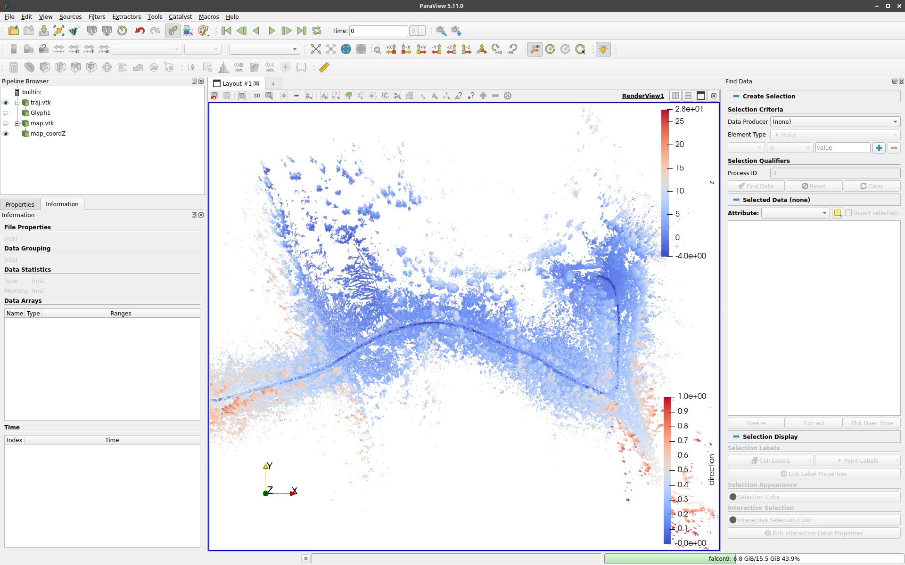
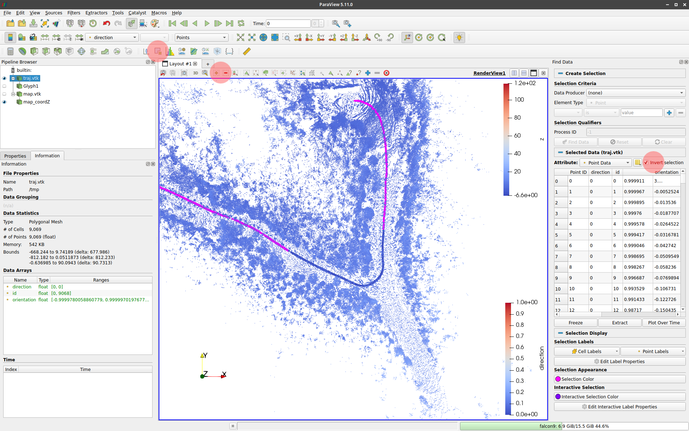

# ltr_tools

Set of tools to work with .ltr files

## Dependencies
+ Eigen
+ libpointmatcher
+ ParaView

## Installation
```
cd ~/
git clone https://github.com/norlab-ulaval/ltr_tools.git
cd ltr_tools/
mkdir build && cd build/
cmake -DCMAKE_BUILD_TYPE=Release ..
make
sudo make install
```

## Uninstallation
```
sudo rm -rf /usr/local/bin/ltr2vtkConvertor /usr/local/bin/inspectLtr /usr/local/bin/ltr_add_z_coord /usr/local/etc/ltr_tools/
```


## Tools
### inspectLtr
Split an .ltr file into map and trajectory files and visualize them in ParaView with predefined window state.

#### Usage
```
ltrInspect <path_to_ltr_file>
```


### ltr_add_z_coord
Add the z coordinate to the first version of an .ltr file format, making it compatible with new code tools.
Z coordinate can either be explicitly set in the third argument, or is derived from each point's nearest neighbors in the map.

#### Usage
```
ltr_add_z_coord <path_to_input_ltr_file> <path_to_output_ltr_file> <z_coord>
```


### ltrEditTrajectory
Split an .ltr file into map and trajectory files and visualize them in ParaView with predefined window state.
The user is asked to edit the trajectory and save it as a .csv file.
A new .ltr file is then created, named `<original_ltr_file_name>_edited.ltr`

#### Usage
```
ltrEditTrajectory <path_to_ltr_file>
```

#### How to remove points from a trajectory in Paraview
First, go to View and toggle the _Find Data_ view.

Press 'g' and select part of the trajectory, that you want to keep (or remove).
Use the _Extract Selection_ button on the top toolbar to extract a new trajectory, 
only keeping the points in the current selection.
If you want to remove the selected part of the trajectory,
use the _Invert selection_ option in the _Find Data_ view.
You can use the _Add selection_ and _Subtract selection_ buttons to create more complex to your trajectories.
The extraction can also be chained.

Finally, export the data. Find the Extracted Selection selected, press 'ctrl+s'
and it to `/tmp/traj.csv`.

Close Paraview. The script will generate a new .ltr file using the edited trajectory.
